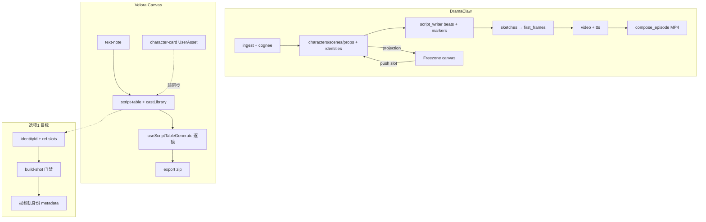

# DramaClaw 学习笔记（Velora 对照）

> 阶段：选项 1–3 MVP 已落地 | 日期：2026-07-21  
> 上游仓库：https://github.com/dramaclaw/dramaclaw（Elastic License 2.0）  
> 本地 clone 状态：`/root/autodl-tmp/oss-study/dramaclaw` **已完整存在**（镜像 tarball 落盘；`README.md` + `docs/` + `src/novelvideo/` + `frontend/` + `docker-compose.yml` 校验通过）

---

## A. 架构摘要

DramaClaw CE 是 **单机「小说/剧本 → 成片」工业化管线**：一个 FastAPI 服务承载全部创意能力，任务进程内执行（`InlineTaskBackend`），项目数据落本地 SQLite + 文件系统，**所有 LLM/图/视频/TTS 经单一 OpenAI-compatible 网关**（`NEWAPI_BASE_URL` / 官方 DC key）。核心包 `src/novelvideo/`，CLI `novelvideo`，前端 React SPA 在 `frontend/`。

### 文字版主流水线

```text
[项目级 global]
ingest（小说摄入 ingest_fast）
  → configure（项目配置：族裔/旁白风格等）
  → characters（角色提取 build_characters）
  → episodes（分集规划 build_episodes）
  → portraits（主角色肖像）

[逐集 episode]
identity_plan（身份规划：每集 identity 菜单）
  → identity_images（身份三视图/服装图生成）
  → script（脚本生成 script_writer；marker {{identity_id}} / [[prop_id]]）
  → sketches（分镜草图 sketch_generation）
  → coloring（配色 + 身份/道具检测）
  → global_optimize（全局视频 prompt 优化 global_optimize_video）
  → first_frames（首帧渲染 selected_regen）
  → tts（IndexTTS2 配音）
  → video（逐 beat 视频 single_video）
  → compose（集合成片 compose_episode + SRT/ZIP 导出）
  → done
```

**证据**：`src/novelvideo/api/routes/pipeline.py` → `_STEP_MAP`（L17–34）；聚合状态 `GET /projects/{project}/pipeline/status`。

**概念映射（产品叙事）**：

```text
导入 + Cognee 故事图 → 角色/场景/道具资产库 → 分集身份规划
→ 结构化脚本（beats）→ 分镜草图 → 首帧 → TTS → 视频 → 合成导出
```

并行探索轨：**Freezone 无限画布**（`src/novelvideo/freezone/`）可与主线共存，满意结果经 `freezone/push` 写回 canonical slot。

### 资产如何注入各镜

DramaClaw 把「谁出现在这一镜」结构化到 **beat 行**，再经解析器变成 **参考图 + prompt 约束**：

```text
Episode 身份菜单（episodes.identity_ids + identity_default_map）
  ↓
脚本写作（workflows/literal_script_writing.py）
  - visual_description 强制 {{identity_id}} marker
  - 道具强制 [[prop_id]] marker
  ↓
Beat 字段（sqlite beats 表 / models.NovelVisualBeat）
  - detected_identities_json
  - detected_props_json
  - scene_ref_json（场景 master / 360 / director control frame 等）
  ↓
渲染前守卫（generators/render_identity_guard.py）
  ↓
资产解析（utils/asset_resolver.py → AssetResolver）
  + 角色参考图映射（services/character_ref_service.py → build_character_map_for_grid）
  ↓
Prompt 组装（generators/prompt_builder.py → PromptComponents）
  - Identity Lock：同一 identity = 同一人
  - scene anchor / prop tag
  ↓
图像网格（generators/nanobanana_grid.py：character_refs + scene_refs 作 image inputs）
  ↓
视频（generators/video_generator.py：首帧 image_path + ShotReference 列表）
```

**Canonical 资产路径**（`utils/path_resolver.py`）：

| 资产 | 路径模式 |
|------|----------|
| 角色肖像 | `assets/characters/{char}/portrait.png` |
| 身份三视图 | `assets/characters/{char}/identities/{identity_name}.png` |
| 场景 master | `assets/scenes/{scene}/master.png` |
| 道具三视图 | `assets/props/{prop}/reference_3view.png` |
| Director World 3GS | `director_worlds/{scene}/v1/`（`director_world/stage_manifest.py`） |

**SQLite 核心表**（`sqlite_store.py`）：`characters`（`identities_json`）、`scenes`、`props`、`episodes`（`identity_ids`, `scene_menu_json`, `prop_menu_json`）、`beats`（`detected_identities_json`, `scene_ref_json`, `video_prompt`）。

### 双轨：主流水线 vs Freezone

| 维度 | 主流水线 | Freezone |
|------|----------|----------|
| 数据 | SQLite beats + canonical 文件槽位 | `freezone/canvas_store.py` 画布节点 |
| 写入契约 | `frames/`、`sketches/`、`assets/` | `freezone/slots.py` → `SlotTarget` / `PushTarget` |
| 主线 → 画布 | `api/routes/freezone.py` 投影 DB 参考图到画布节点 | `_collect_mainline_typed_reference_urls()` |
| 画布 → 主线 | — | `POST .../freezone/push` → `slot_target_path()` + `sync_slot_after_write()` |
| 失效标记 | 全局资产变更 | `record_slot_stale_marks()` → `freezone/stale_marks.json` |

**证据**：`freezone/slots.py` L1–5 注释定义 slot 为「主线与 Freezone Commit 共享的 canonical 写目标」。

### Ports & Adapters（CE vs EE）

**定义**：`src/novelvideo/ports/`（Protocol）  
**注册**：`ports/registry.py` → `ensure_bootstrap()`；`ST_EDITION=ce` 时加载 `ports/local/register_local_ports()`  
**硬规则**：核心永不 import EE；运行时按 edition 注入实现。

| Port | CE 默认实现 | 文件 |
|------|-------------|------|
| `auth` | `FileAuthPort` | `ports/local/auth.py` |
| `project_registry` | `SQLiteProjectRegistry` | `ports/local/project.py` |
| `project_access` | `AllowAllProjectAccess` | `ports/local/project.py` |
| `task_backend` | `InlineTaskBackend` | `ports/local/tasks.py` |
| `cancellation_store` | `InMemoryCancellationStore` | `ports/local/tasks.py` |
| `usage_meter` / `credit_quote` | `NoOpUsageMeter` / `LocalCreditQuote` | `ports/local/usage.py` 等 |

### OpenAI-compatible 模型网关

| 层 | 路径 | 说明 |
|----|------|------|
| 配置 | `config.py` | `NEWAPI_BASE_URL`, `NEWAPI_API_KEY`, `get_newapi_runtime_credentials()` |
| 运行时 | `model_gateway_settings.py`, `model_gateway_runtime.py` | CE `settings.db` 网页配置优先于 `.env` |
| 管理 API | `api/routes/model_gateway.py` | `GET/POST /model-gateway/*` |
| LLM | `config.get_newapi_text_pydantic_model()` | 全部 Agent 走 `/v1` 兼容端点 |
| 图像 | `generators/image_generator.py`, `nanobanana_*.py` | 角色/场景/网格渲染 |
| 视频 | `generators/video_generator.py`, `freezone/video_node.py` | `VIDEO_BACKEND=newapi_<model>` |
| TTS | `generators/tts_generator.py`, `audio/indextts2_beat_audio_task.py` | `audio_generation_indextts2` |

官方默认网关：`official_defaults.py` → `OFFICIAL_NEWAPI_BASE_URL`；自建见 `docker-compose.selfhosted.yml`（bundled `newapi` :3000）。

### 技术栈与部署

| 组件 | 路径/端口 |
|------|-----------|
| FastAPI | `api/app.py` → `create_app()`，默认 `:8780` |
| React 前端 | `frontend/`（nginx 反代 `/api` + `/static`） |
| Docker | `docker-compose.yml`：`api` + `web`；`docker-compose.selfhosted.yml` 加 `newapi` |
| 任务 | CE 进程内 `InlineTaskBackend`；EE 可 Celery+Redis |
| Agent 聊天 | Hermes（`DRAMACLAW_CHAT_BACKEND=hermes`） |
| 故事图 | `cognee/`（角色/关系/时间线） |

### 关键子包索引

| 包 | 职责 |
|----|------|
| `agents/` | `IdentityPlanner`, `VideoPromptBuilder`, `KeyframePromptBuilder` 等 |
| `task_backend/runners/` | `ingest`, `graph_build`, `identity`, `script`, `sketch`, `render`, `video`, `audio` |
| `director_world/` | 3GS 舞台、`DirectorWorldService`、360 全景 |
| `export/` | `episode_export.py` 成片与资产包 |
| `verification/` | 草图/渲染一致性校验与修复循环 |

---

## B. DramaClaw vs Velora 对照表

| 维度 | DramaClaw | Velora（AIStudio） |
|------|-----------|-------------------|
| **产品形态** | 项目级工业化管线 + Freezone 双轨 | React Flow 画布为主；`velora_canvas.yaml` manifest 编排 Agent 阶段 |
| **剧本→分镜** | `script_writer` → beats + marker 约束 | `generate_script_table` → `ScriptTableNode` rows |
| **角色资产** | 项目 SQLite `characters` + 身份三视图文件树 | `castLibrary[]` 嵌在 `script-table` 节点；`CharacterCardNode` + `UserAsset` API |
| **场景资产** | `scenes` 表 + master/360/3GS | `sceneLibrary[]` + `locationId` 绑定 |
| **跨镜一致性** | `{{identity_id}}` 强制 marker + Identity Lock + 三视图 ref | `entityRefs` 文本匹配 + `flux-pulid` 首张脸；`continuityMode`/`visualContinuity` 启发式 |
| **道具** | `props` + `[[prop_id]]` + `reference_3view.png` | 无独立 prop 库；道具写在 prompt 文本 |
| **双轨 UX** | 主线 pipeline 面板 + Freezone 画布 promote | 单画布自由连线；无「项目流水线面板」产品叙事 |
| **任务调度** | 分阶段 async task + SSE；可跳过/续跑 | 画布节点级任务 + `useScriptTableGenerate` 顺序批量 |
| **模型接入** | 单一 NewAPI OpenAI-compatible 网关 | `registered_models` + `llm_router`（文本）+ `providers/comfyui.py`（图/视频）+ `short_video_factory` 旁路 |
| **合成导出** | `compose_episode` + SRT/ZIP | `export_service` Word/zip；无集级 MP4 合成主链 |
| **Director / 3D** | `director_world` 3GS + control frame → sketch | 无等价模块 |
| **许可证** | Elastic-2.0（不可转售托管竞品） | 自有闭源 |

---

## C. 可学设计 / 不可抄代码

### 可学设计（自写等价实现）

1. **项目级身份菜单**：每集 `identity_ids` + 默认映射；脚本写作只允许菜单内 `{{identity_id}}`（对照 `literal_script_writing.py` 校验逻辑）。
2. **Beat 级结构化引用**：`detected_identities` / `detected_props` / `scene_ref` 与 prompt marker 双向校验。
3. **Canonical 资产槽位 + stale 标记**：全局资产变更后标记受影响 beat/slot，避免静默不一致（`freezone/slots.py` 思路）。
4. **双轨产品叙事**：工业化流水线负责「交付」，Freezone 负责「探索」，经 push 回写而非两套数据孤岛。
5. **Ports & Adapters**：引擎与运行时解耦；Velora 可借鉴「Protocol + CE 默认实现」分离 ComfyUI 本地与未来多租户。
6. **统一模型网关抽象**：文本/图/视频/TTS 同一配置面 + 模型名映射（Velora 可对齐为 provider-agnostic 层，底层仍走 ComfyUI）。
7. **渲染前 identity guard**：出图前强制检测 beat 是否已解析身份，失败可修复而非脏数据下游。
8. **风格模板项目级注入**：`prompts/` + `styles/` 全项目 style/negative 约束。

### 不可抄代码（Elastic License 2.0）

1. **禁止**将 DramaClaw 源码文件复制进 `/root/autodl-tmp/AIStudio` 或任何 Velora 交付物。
2. **禁止**把 DramaClaw 作为托管服务转售，或提供与 DramaClaw 实质性相同的 SaaS（许可证核心限制）。
3. **禁止**照搬 `src/novelvideo/` 下实现（agents、generators、freezone、ports 等）；仅学习架构与产品语义，**自写** Velora 等价模块。
4. **禁止**复制前端 React 组件、ComfyUI workflow JSON、Docker 镜像层直接嵌入 Velora 发行版。
5. **可引用**公开文档、API 形状、数据模型概念；实现须独立编写并记录设计来源。

许可证全文：`/root/autodl-tmp/oss-study/dramaclaw/LICENSES/Elastic-2.0.txt`

---

## D. 最小切片三选一

| 选项 | 内容 | 与 Velora 现状关系 |
|------|------|-------------------|
| **1（推荐）** | 强化 Character/Location 资产库 + 出图/出视频 prompt **强制注入**一致性约束 | 已有 `castLibrary`/`sceneLibrary`/`entityRefs`/`flux-pulid`；缺结构化 identity slot 与视频轨身份传递 |
| 2 | 双轨 UX —「项目流水线面板」+ 现有 Freeform 画布（对照 Freezone） | 产品面大；依赖项目级资产语义先立住 |
| 3 | 轻量 Model Gateway（OpenAI-compatible 适配层） | 有价值但触及 Admin 文本模型硬约束；与 ComfyUI 本地栈差异大 |

### 推荐：选项 1

**理由**：

1. OpenMontage 已覆盖 pipeline manifest；Pixelle 已覆盖 workflow registry + 短视频工厂 MVP — DramaClaw **核心差异**是跨镜身份一致性。
2. Velora 地基齐全（`manage_cast`/`manage_scene`、`entity_refs.py`、`shot_prompt_package.py`），增量最小、验收可测。
3. 选项 2 需要先有稳定资产模型；选项 3 适合在一致性闭环后再做。

---

## E. 推荐切片实施步骤（选项 1，5–8 步）

1. **扩展资产 schema（项目级，非抄码）**  
   - 在 `UserAsset` / 画布 `castLibrary` 条目增加结构化 slot：`faceUrl`、`threeViewUrl`、`costumeUrl`（Velora 自研字段名）。  
   - 文件：`backend/schemas/assets.py`、`frontend/src/utils/canvas/castLibrary.js`、`CharacterCardNode.jsx`。

2. **引入 identity_id 约定（Velora 自有命名）**  
   - 格式 `{characterName}_{variant}`，写入 `castLibrary[].identityId`；`manage_cast` skill 与 `agent_service.py` Prompt 要求 Agent 输出 identity 而非仅裸名。  
   - 文件：`backend/agent_skills/velora_canvas/manage_cast.md`、`backend/services/agent_service.py`。

3. **分镜行强制实体绑定**  
   - `ScriptTableNode` row 增加 `identityIds[]` / `propIds[]`（或由 `promptMentions` 升级）；`manage_scene` 保持 `locationId`。  
   - 文件：`ScriptTableNode.jsx`、`sceneLibrary.js`。

4. **后端 prompt 包强制注入**  
   - `entity_refs.py` / `shot_prompt_package.py`：无绑定 identity 时 `build-shot` 返回 `missing_identity` 门禁（对照 DramaClaw `render_identity_guard` 语义，自写实现）。  
   - `prompt_builder.py`：合并 `entity_lines_for_prompt` + Identity Lock 文案模板（自写英文/中文约束句）。

5. **出图路径统一 reference_images**  
   - `useScriptTableGenerate.js`：`collectEntityReferenceUrls` 按 slot 优先级（三视图 > 肖像 > 单图）；保留 `flux-pulid` 正脸轨。  
   - `providers/comfyui.py`：`submit_image_prompt` 记录每镜 `entity_ref_audit` 到任务 metadata。

6. **出视频路径补齐身份**  
   - 当前视频仅首帧 + compile prompt；扩展 `runScriptTableDirectVideoGenerate` 将角色参考图传入支持 i2v+ref 的 workflow（或强化首帧必须含身份）。  
   - 文件：`useScriptTableGenerate.js`、`comfyui/client.py`。

7. **全局资产 ↔ 分镜库同步（轻量）**  
   - `CharacterCardNode` 更新 `UserAsset` 时，同步同 `assetId` 的 `castLibrary` 条目；避免双库漂移。  
   - 文件：`CharacterCardNode.jsx`、`assetStore` 相关 hook。

8. **测试与探针**  
   - `backend/tests/test_entity_refs.py` 扩展：给定 cast+row → prompt 含 identity 行 + ref URL 列表。  
   - 手测：manage_cast → 三视图 slot → 连续 3 镜出图 reference_images 含同一 identity。

**拟改文件汇总**：

| 操作 | 路径 |
|------|------|
| 修改 | `frontend/src/utils/canvas/entityRefs.js`, `castLibrary.js`, `sceneLibrary.js` |
| 修改 | `frontend/src/components/canvas/CharacterCardNode.jsx`, `ScriptTableNode.jsx` |
| 修改 | `frontend/src/hooks/canvas/useScriptTableGenerate.js` |
| 修改 | `backend/services/entity_refs.py`, `shot_prompt_package.py`, `prompt_builder.py` |
| 修改 | `backend/providers/comfyui.py` |
| 修改 | `backend/agent_skills/velora_canvas/manage_cast.md`, `manage_scene.md` |
| 可选 | `backend/schemas/assets.py` |
| 新建 | `backend/tests/test_entity_identity_injection.py` |

---

## F. 验收标准（3 条可测）

1. **门禁**：分镜行引用 `castLibrary` 中角色但无 `identityId` 或未配图时，`POST /api/prompt/build-shot` 返回明确 `missing_identity`（或等价 422），前端阻止出图/出视频。

2. **注入**：同一 `identityId` 连续 3 镜批量出图，任务 `reference_images`（或 ComfyUI 提交日志）均包含该 identity 的三视图/肖像 URL，且编译后 prompt 含一致性约束句（pytest 或探针 JSON 快照）。

3. **视频不丢身份**：出视频任务除首帧外，metadata 记录 `identity_ids` 与来源资产；对比改前，至少 1 条支持 ref 的视频 workflow 能收到角色参考（或文档化「仅首帧继承」+ 强制首帧含角色）。

---

## G. 差距清单：Velora CharacterCard / ScriptTable vs DramaClaw 资产库

| # | 差距 | DramaClaw 做法 | Velora 现状 | 证据路径 |
|---|------|----------------|-------------|----------|
| 1 | **无项目级 Entity Registry** | `characters`/`scenes`/`props` SQLite 表，全项目唯一源 | `castLibrary`/`sceneLibrary` 嵌在 `script-table` 节点 data，换表即丢绑定 | Velora: `ScriptTableNode.jsx`；DC: `sqlite_store.py` |
| 2 | **无身份变体（identity）模型** | `CharacterIdentity` + 每集 `identity_ids` 菜单 | 角色仅 `name`/`appearance`/`imageUrl`，无「童年/成年/战损」分轨 | DC: `models.py`, `identity_planner.py`；Velora: `castLibrary.js` |
| 3 | **无三视图 / 多 slot 参考图** | `identities/{name}.png`、costume、portrait 分路径 | `referenceImages` 最多 4 张，无语义 slot | DC: `path_resolver.py`；Velora: `CharacterCardNode.jsx` |
| 4 | **脚本级 marker 约束缺失** | `{{identity_id}}` / `[[prop_id]]` 写作期强制 + 校验 | 靠 `promptMentions` 与文本包含启发式匹配 | DC: `literal_script_writing.py`；Velora: `entityRefs.js` |
| 5 | **Beat 级 detected 引用未结构化** | `beats.detected_identities_json` 驱动渲染 | row 无 `identityIds`；后端 `entity_lines_for_prompt` 弱依赖文本 | DC: `nanobanana_grid.py`；Velora: `entity_refs.py` |
| 6 | **视频轨丢弃角色参考** | `video_generator` 首帧 + `ShotReference` | 视频仅 `directResultUrl` 首帧 + compile prompt | Velora: `useScriptTableGenerate.js`；DC: `video_generator.py` |
| 7 | **无道具资产库** | `props` 表 + 三视图 + `[[prop_id]]` | 道具只在镜头描述文本中 | DC: `props.py`, `prop_reference.py` |
| 8 | **无资产变更失效（stale）机制** | `record_slot_stale_marks()` 标记受影响槽位 | 改角色图后旧镜头静默沿用或需手刷 | DC: `freezone/slots.py`；Velora: 无等价 |
| 9 | **全局 UserAsset 与分镜库不同步** | 项目资产即 canonical 源 | `CharacterCardNode` 写 API，`manage_cast` 只写节点内库 | Velora: `CharacterCardNode.jsx`, `manage_cast.md` |
| 10 | **无 Director World / 场景 3GS** | `director_world` control frame → sketch | 场景仅 2D `imageUrl` | DC: `director_world/`；Velora: `sceneLibrary.js` |

---

## 附录：关键文件索引

### DramaClaw

| 模块 | 路径 |
|------|------|
| 流水线阶段 | `/root/autodl-tmp/oss-study/dramaclaw/src/novelvideo/api/routes/pipeline.py` |
| 生成任务 | `/root/autodl-tmp/oss-study/dramaclaw/src/novelvideo/api/routes/generation.py` |
| 任务 runners | `/root/autodl-tmp/oss-study/dramaclaw/src/novelvideo/task_backend/runners/` |
| 数据模型 | `/root/autodl-tmp/oss-study/dramaclaw/src/novelvideo/models.py` |
| 脚本 marker | `/root/autodl-tmp/oss-study/dramaclaw/src/novelvideo/workflows/literal_script_writing.py` |
| Prompt 组装 | `/root/autodl-tmp/oss-study/dramaclaw/src/novelvideo/generators/prompt_builder.py` |
| 资产解析 | `/root/autodl-tmp/oss-study/dramaclaw/src/novelvideo/utils/asset_resolver.py` |
| 角色 ref 服务 | `/root/autodl-tmp/oss-study/dramaclaw/src/novelvideo/services/character_ref_service.py` |
| Freezone 槽位 | `/root/autodl-tmp/oss-study/dramaclaw/src/novelvideo/freezone/slots.py` |
| Freezone API | `/root/autodl-tmp/oss-study/dramaclaw/src/novelvideo/api/routes/freezone.py` |
| Ports 注册 | `/root/autodl-tmp/oss-study/dramaclaw/src/novelvideo/ports/registry.py` |
| 模型网关 | `/root/autodl-tmp/oss-study/dramaclaw/src/novelvideo/model_gateway_settings.py` |
| Director World | `/root/autodl-tmp/oss-study/dramaclaw/src/novelvideo/director_world/` |
| Docker | `/root/autodl-tmp/oss-study/dramaclaw/docker-compose.yml` |
| 架构文档 | `/root/autodl-tmp/oss-study/dramaclaw/docs/en/concepts/architecture.md` |

### Velora

| 模块 | 路径 |
|------|------|
| 角色卡 | `/root/autodl-tmp/AIStudio/frontend/src/components/canvas/CharacterCardNode.jsx` |
| 分镜表 | `/root/autodl-tmp/AIStudio/frontend/src/components/canvas/ScriptTableNode.jsx` |
| 实体引用 | `/root/autodl-tmp/AIStudio/frontend/src/utils/canvas/entityRefs.js` |
| 批量出图/视频 | `/root/autodl-tmp/AIStudio/frontend/src/hooks/canvas/useScriptTableGenerate.js` |
| manage_cast | `/root/autodl-tmp/AIStudio/backend/agent_skills/velora_canvas/manage_cast.md` |
| manage_scene | `/root/autodl-tmp/AIStudio/backend/agent_skills/velora_canvas/manage_scene.md` |
| Pipeline manifest | `/root/autodl-tmp/AIStudio/backend/pipelines/velora_canvas.yaml` |
| 后端 entity_refs | `/root/autodl-tmp/AIStudio/backend/services/entity_refs.py` |
| Prompt 包 | `/root/autodl-tmp/AIStudio/backend/services/shot_prompt_package.py` |
| 视觉连贯 | `/root/autodl-tmp/AIStudio/backend/services/script_shot_strategy.py` |
| ComfyUI | `/root/autodl-tmp/AIStudio/backend/providers/comfyui.py` |
| 模型注册 | `/root/autodl-tmp/AIStudio/backend/services/registered_model_sync.py` |
| LLM 路由 | `/root/autodl-tmp/AIStudio/backend/services/llm_router.py` |

---

## 对照图：DramaClaw 双轨 vs Velora 画布



---

## H. 选项 1 落地记录（2026-07-21）

### identity 字段约定

```text
castLibrary[]:
  identityId: "{slugName}_{variant}"   # 例 alice_default
  faceUrl | threeViewUrl | costumeUrl | imageUrl（兼容）
script-table row:
  identityIds: string[]                # 优先绑定
参考图优先级: threeViewUrl > faceUrl > costumeUrl > imageUrl
```

### missing_identity 响应示例

```json
HTTP 422
{
  "detail": {
    "code": "missing_identity",
    "message": "角色 Alice 缺少 identity 或参考图，请先完善角色资产",
    "names": ["Alice"],
    "identity_ids": ["alice_default"]
  }
}
```

前端 `useScriptTableGenerate` 识别 `detail.code === "missing_identity"` 后阻止出图/出视频。

### 视频路径身份保留（一句话）

当前视频 workflow 不传多参考图：**强制首帧来自本分镜已生成的分镜图**（`directResultUrl`），任务 `generation_params.identity_ids` 记录身份；引用角色但无成图时先挡出视频。

### 改动文件

| 操作 | 路径 |
|------|------|
| 修改 | `frontend/src/utils/canvas/castLibrary.js`, `entityRefs.js`, `castLibrarySync.js` |
| 修改 | `frontend/src/components/canvas/CharacterCardNode.jsx`, `ScriptTableNode.jsx` |
| 修改 | `frontend/src/hooks/canvas/useScriptTableGenerate.js` |
| 修改 | `frontend/src/utils/canvas/agentPipeline.js`, `scriptTableKeyframes.js` |
| 修改 | `frontend/src/components/canvas/GenerationCardNode.jsx`, `VideoGenerationNode.jsx` |
| 修改 | `backend/services/entity_refs.py`, `schemas/prompt_builder.py`, `routers/prompt.py` |
| 修改 | `backend/schemas/tasks.py`, `services/task_generation_params.py`, `routers/tasks.py` |
| 修改 | `backend/agent_skills/velora_canvas/manage_cast.md`, `manage_scene.md` |
| 新建 | `backend/tests/test_entity_identity_injection.py` |

### pytest 摘要

```bash
cd backend && python -m pytest tests/test_entity_identity_injection.py tests/test_prompt_builder.py -q
# 39 passed（identity 8 + prompt_builder 31）
```

### 已知限制

- `UserAsset` DB 未扩表；权威源为画布 `castLibrary` + CharacterCard 轻量同步
- 视频轨不传角色多 ref，仅首帧 + metadata 审计
- 未引用角色的旧分镜行不触发门禁（兼容）
- 选项 2 双轨面板、选项 3 Model Gateway、Director World 未做
+ 选项 2 双轨面板、选项 3 Model Gateway 已 MVP 落地（见 §I）；Director World 未做

---

## I. 选项 2 / 3 落地记录（2026-07-21）

### 选项 2 — 双轨 UX

- **PipelinePanel**：左侧可折叠 9 步主链；当前步高亮、完成打勾；「运行此步」经 `agentSendRef` 走 Agent；「继续」同手动续跑。
- **探索轨**：`exploreTrack.js` 判定非主链交付的 image-gen/video-gen；节点角标「探索」。
- **轻量采纳**：选中探索 image-gen → PipelinePanel 选镜号 → 写 `rows[N].directResultUrl` + `directStatus: completed`（纯前端，无 REST）。

### 选项 3 — 文本 Model Gateway

- **resolver**：`model_gateway_resolver.py` — 行级 `api_base` → 全局 `SystemSetting` → fallback。
- **Admin**：`GET/PUT /api/admin/model-gateway`、`POST .../test-connection`；`ModelManagement` 增「默认文本网关」卡片。
- **接入**：`agent_service._resolve_agent_model`、`qwen.invoke_configured_text_llm` / `_call_registered_model`。
- **不覆盖**：ComfyUI 图/视频路径；`llm_router` 仍选模型行。

### Gateway 配置示例（脱敏）

```text
enabled: true
base_url: https://api.example.com/v1
api_key: ****x7K9
default_model: gpt-4o-mini
```

### 改动文件

| 阶段 | 路径 |
|------|------|
| A | `frontend/src/components/canvas/PipelinePanel.jsx`, `.css` |
| A | `frontend/src/utils/canvas/exploreTrack.js`, `pipelinePanelState.js` |
| A | `frontend/src/pages/Canvas.jsx`, `GenerationCardNode.jsx`, `VideoGenerationNode.jsx` |
| B | `backend/services/model_gateway_resolver.py` |
| B | `backend/routers/admin_model_gateway.py`, `main.py` |
| B | `backend/services/agent_service.py`, `qwen.py` |
| B | `frontend/src/pages/Admin/ModelManagement.jsx` |
| B | `backend/tests/test_model_gateway_resolver.py` |

### pytest 摘要

```bash
cd backend && python -m pytest \
  tests/test_entity_identity_injection.py \
  tests/test_prompt_builder.py \
  tests/test_pipeline_manifest.py \
  tests/test_model_gateway_resolver.py -q
```

### 已知限制

- 无完整 Freezone slot / push 投影
- 无图/视频统一 `/v1` 代理（仅文本 LLM）
- Pipeline 完成态为前端启发式，非后端权威状态机
- 探索采纳仅支持 image-gen → 分镜直连图

### 学习进度

| 项目 | 状态 |
|------|------|
| DramaClaw | ✅ 选项1–3 MVP |
| 2026-07-21 | 选项1 identity + 选项2 Pipeline/探索 + 选项3 文本网关 |
