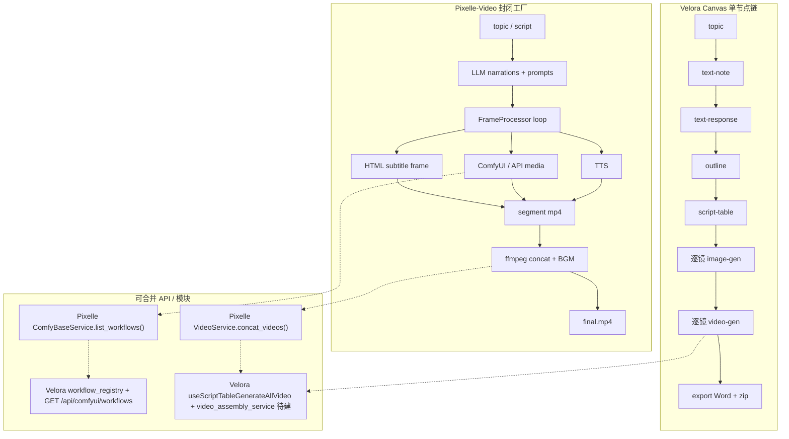

# Pixelle-Video 学习笔记（Velora 对照）

> 阶段：第 1 阶段只读分析 | 日期：2026-07-21  
> 上游仓库：https://github.com/AIDC-AI/Pixelle-Video（Apache-2.0）  
> 本地 clone 状态：`/root/autodl-tmp/oss-study/Pixelle-Video` **已完整存在**（`README.md` + `pixelle_video/` + `workflows/` 校验通过；selfhost 8 个、runninghub 21 个 workflow JSON）

---

## A. Pixelle 架构摘要

Pixelle-Video 的核心设计是 **封闭线性工厂**：`PixelleVideoCore` 统一挂载 LLM / TTS / Media / Video 服务，通过 `StandardPipeline`（Template Method）一键执行「主题 → 成片」；ComfyUI workflow 与业务层通过 `ComfyBaseService` + `workflows/` 目录解耦，支持 selfhost / RunningHub / 直连 API 三路后端。

### 文字版流水线图

```text
Input (topic 或 fixed script)
  │
  ▼
setup_environment ── 创建 output/{task_id}/ 任务目录
  │
  ▼
generate_content ── LLM 生成旁白 / 或 split 固定文案
  │
  ▼
determine_title ── LLM 生成标题
  │
  ▼
plan_visuals ── LLM 生成每帧 image prompt（static 模板可跳过）
  │
  ▼
initialize_storyboard ── 构建 Storyboard + StoryboardFrame 列表
  │
  ▼
produce_assets ── 逐帧 FrameProcessor 循环
  │   ├─ 1/4 TTS（Edge-TTS local 或 ComfyUI tts_* workflow）
  │   ├─ 2/4 Media（image_* / video_* workflow 或 api/* 直连）
  │   ├─ 3/4 HTML 模板合成（Playwright 渲染字幕帧）
  │   └─ 4/4 单段 video segment mp4
  │
  ▼
post_production ── ffmpeg concat 多段 + 可选 BGM
  │
  ▼
finalize ── output/{task_id}/final.mp4 + 持久化 metadata
```

### 入口层

| 入口 | 路径 | 说明 |
|------|------|------|
| **Streamlit（主产品）** | `web/app.py` → `web/pages/1_🎬_Home.py` | `st.navigation` 多页；`start_web.sh` 启动 |
| **FastAPI（程序化）** | `api/app.py` → `api/routers/video.py` | 同步/异步 `POST /video/generate`；`api/tasks/manager.py` 管异步任务 |
| **核心编排类** | `pixelle_video/service.py::PixelleVideoCore` | 全局单例 `pixelle_video`；`generate_video(pipeline="standard")` |
| **CLI** | 无独立 CLI 包 | `pyproject.toml` 未定义 `[project.scripts]` |

`PixelleVideoCore.initialize()` 挂载服务并注册 pipelines（`standard` / `custom` / `asset_based`）：

```python
# pixelle_video/service.py L200-222
self.llm = LLMService(self.config)
self.tts = TTSService(self.config, core=self)
self.media = MediaService(self.config, core=self)
self.api_media = APIProviderMediaService(self.config, core=self)
self.video = VideoService()
self.frame_processor = FrameProcessor(self)
self.pipelines = {
    "standard": StandardPipeline(self),
    "custom": CustomPipeline(self),
    "asset_based": AssetBasedPipeline(self),
}
self.generate_video = self._create_generate_video_wrapper()
```

### 流水线阶段（真实代码校正）

**生命周期 8 步**（`pixelle_video/pipelines/linear.py` L70-78）：

1. `setup_environment`
2. `generate_content`
3. `determine_title`
4. `plan_visuals`
5. `initialize_storyboard`
6. `produce_assets`
7. `post_production`
8. `finalize`

**StandardPipeline 实现**（`pixelle_video/pipelines/standard.py`）：

| 阶段 | 关键逻辑 | 证据 |
|------|----------|------|
| 主题→脚本 | `mode=generate` → `generate_narrations_from_topic()`；`mode=fixed` → `split_narration_script()` | L106-128 |
| 配图规划 | `plan_visuals()` → `generate_image_prompts()` + `prompt_prefix`；`static_*` 模板跳过媒体生成 | L154-227 |
| 逐帧生产 | `produce_assets()` → `frame_processor`；RunningHub 可并行 | L294+ |
| 合成 | `post_production()` → `VideoService.concat_videos()` + BGM | L409-424 |

**单帧四步**（`pixelle_video/services/frame_processor.py`）：

- `_step_generate_audio` — TTS
- `_step_generate_media` — **TTS 时长驱动视频时长**（L18-20 注释）
- `_step_compose_frame` — HTML 模板 + 字幕
- `_step_create_video_segment` — 图/视频 + 音频 → 单段 mp4

**ffmpeg 合成**（`pixelle_video/services/video.py`）：

- `concat_videos()` — 多段拼接 + 可选 BGM（loop/once）
- `merge_audio_video()` / `create_video_from_image()` / `add_bgm()`

### workflows/ — ComfyUI JSON 热插拔

**目录结构**：

```text
workflows/
├── selfhost/          # 完整 ComfyUI API JSON（占位符 $prompt.value! 等）
│   ├── image_flux.json
│   ├── tts_edge.json
│   └── video_wan2.1_fusionx.json
└── runninghub/        # 包装器 {"source":"runninghub","workflow_id":"..."}
    ├── image_flux.json
    └── video_wan2.1_fusionx.json
```

**选择与传参**（`pixelle_video/services/comfy_base_service.py`）：

| 机制 | 说明 |
|------|------|
| `_scan_workflows()` | 扫描 `workflows/{source}/*.json`，按 `WORKFLOW_PREFIX` 过滤（`tts_` / `image_` / `video_`） |
| Key 格式 | `{source}/{filename}`，如 `runninghub/image_flux.json` |
| `_resolve_workflow(key)` | 按 key 匹配；未指定则用 config `default_workflow` |
| 执行 | `MediaService` / `TTSService` 通过 ComfyKit `kit.execute(workflow_input, params)` |
| 热替换 | `data/workflows/` **优先于** 内置 `workflows/`（`pixelle_video/utils/os_util.py::get_resource_path`） |
| API 虚拟 workflow | `api/...` key → `pixelle_video/services/api_media.py`（不走 JSON 文件） |

**RunningHub 包装示例**（`workflows/runninghub/image_flux.json`）：

```json
{"source": "runninghub", "workflow_id": "1983427617984585729"}
```

### 配置分层

| 层 | 配置键 | 实现 |
|----|--------|------|
| **LLM** | `llm.api_key / base_url / model` | `pixelle_video/services/llm_service.py`（OpenAI SDK 兼容） |
| **ComfyUI 全局** | `comfyui.comfyui_url / runninghub_api_key / runninghub_concurrent_limit` | `ComfyBaseService._prepare_comfykit_config()` |
| **TTS** | `comfyui.tts.default_workflow`；`inference_mode: local\|comfyui` | `pixelle_video/services/tts_service.py`；local 用 Edge-TTS |
| **Image/Video** | `comfyui.image\|video.default_workflow` + `prompt_prefix` | `pixelle_video/services/media.py` |
| **直连 API** | `api_providers.{openai,dashscope,ark,kling}` | `pixelle_video/services/api_media.py` + `services/api_services/*` |
| **模板** | `template.default_template` | `templates/{1080x1920,1920x1080,...}/*.html` |
| **Schema** | — | `pixelle_video/config/schema.py` + `config/manager.py` |

示例见 `config.example.yaml`。

### 与 Velora「无限画布单节点」的产品形态差异

| 维度 | Pixelle-Video | Velora |
|------|---------------|--------|
| **产品形态** | 一键短视频工厂（封闭线性 pipeline） | 无限画布 + Agent 单步推进 |
| **用户路径** | 填主题 → 点生成 → 拿 `final.mp4` | 创建 text-note → script-table → 逐镜 image/video 节点 |
| **编排粒度** | 整条 `StandardPipeline` 一次跑完 | Agent 每轮只推进一步、一镜（`agent_service.py`） |
| **输出** | 单条合成成片 + BGM | 多段独立镜头 MP4 + Word/zip 导出 |
| **ComfyUI** | workflow 目录化、按名热替换 | Python 程序化建图 + JSON 模板 patch，耦合在代码里 |

---

## B. Pixelle vs Velora 对照表

| 维度 | Pixelle-Video | Velora（AI Studio） | 缺口 / 优势 |
|------|---------------|---------------------|-------------|
| **产品路径** | 主题 → 一键 `final.mp4` | 主题 → 剧本 → 分镜表 → 逐镜片段 | Velora 缺「主题→成片」封闭路径 |
| **编排器** | `PixelleVideoCore` + `LinearVideoPipeline` | `agent_service.py` + `velora_canvas.yaml` manifest | Velora 强在画布探索；Pixelle 强在工厂闭环 |
| **流水线终点** | `post_production` concat + BGM | `generate_video` 止于单镜 `shot_video` | Velora 无 `assemble_final_video` stage |
| **ComfyUI 耦合** | `ComfyBaseService` + `workflows/` 按名加载 | `providers/comfyui.py` 硬编码节点 ID；`comfyui/client.py` JSON patch | Velora workflow 与业务耦合度高 |
| **Workflow 热替换** | `data/workflows/` 覆盖内置 | 改 workflow 需改 Python 或内联 patch | Velora 无 registry / 列表 API |
| **TTS / 旁白** | Edge-TTS local + ComfyUI `tts_*` | 无 TTS 服务 | Velora 缺口 |
| **字幕** | HTML 模板 + Playwright 渲染烧入帧 | 无字幕生成/烧录（负向词避免 subtitles） | Velora 缺口 |
| **BGM** | `VideoService.concat_videos(bgm_path=...)` | 仅 AudioGen SFX + `audio_mix.py` amix | Velora 无配乐轨 |
| **GPU 调度** | 无多节点池（单 ComfyUI URL / RunningHub） | `gpu_pool.py` 多节点 capability 标签 | Velora 优势 |
| **批量出片** | pipeline 内逐帧 + RunningHub 并行 | `useScriptTableGenerate.js` 顺序逐镜 | Velora 有批量但无合成 |
| **导出** | `output/{task_id}/final.mp4` | `export_service.py` Word + 素材 zip | Velora 非 master MP4 |
| **直连 API 视频** | `api_providers` + `api/*` 虚拟 workflow | Seedance 等绕过 ComfyUI | 两边均有，形态不同 |
| **许可证** | Apache-2.0（改造友好） | 自研闭源 | 可学设计，避免整模块粘贴 |

### Velora 已有 pipeline 步骤（已核实）

`backend/pipelines/velora_canvas.yaml` 共 9 stage，主链止于 `generate_video`（L108-123），产出 `shot_video`。无 TTS / concat / BGM / final.mp4 相关 stage。

**后端任务路由**（`backend/routers/tasks.py`）：

- `POST /api/tasks/text` — LLM 剧本文本
- `POST /api/tasks/image` — ComfyUI 生图（`providers/comfyui.py`）
- `POST /api/tasks/video` — 多 backend（wan/hunyuan/ltx2/ltx23/seedance）

**前端批量**（`frontend/src/hooks/canvas/useScriptTableGenerate.js`）：

- `runScriptTableGenerateAll` — 顺序逐镜出图
- `runScriptTableGenerateAllVideo` — 顺序逐镜出视频，等至终端态

---

## C. 「可直接借鉴 / 需自写适配」清单（Apache-2.0）

Apache-2.0 允许学习与改造，但 Velora 栈与产品形态不同；**建议抽设计自己写，避免大段复制粘贴**。

### 可直接借鉴（设计模式）

| 设计模式 | Pixelle 参考 | Velora 自写方向 |
|----------|--------------|-----------------|
| Workflow 目录 + 按名加载 | `ComfyBaseService._scan_workflows()` / `_resolve_workflow()` | `backend/comfyui/workflow_registry.py` |
| 用户覆盖目录 | `get_resource_path("workflows", ...)` 优先 `data/workflows/` | `VELORA_WORKFLOW_OVERRIDE_DIR` 或 `data/workflows/` |
| 多后端统一接口 | selfhost / runninghub / `api/*` 三路 | 保留 Velora gpu_pool + 新增 registry 层 |
| TTS 时长驱动视频 | `frame_processor.py` 将 audio duration 传给 media workflow | 后续短视频工厂 stage |
| Template Method 流水线 | `LinearVideoPipeline` 8 步生命周期 | 新 pipeline `short_video_factory.yaml`（选项 2） |
| 配置分层 | `config.example.yaml` llm / comfyui.tts\|image\|video / api_providers | 对照 Velora `registered_models` + env |
| ffmpeg 后期服务 | `VideoService.concat_videos` + BGM | `video_assembly_service.py`（选项 2/3） |
| HTML 字幕模板 | `templates/1080x1920/*.html` | 竖横屏模板服务（选项 3） |

### 需自写适配（不宜整模块搬运）

| 项 | 原因 |
|----|------|
| `PixelleVideoCore` 整类 | Velora 已有 FastAPI + 画布节点模型，应挂新 service 而非替换 core |
| ComfyKit 依赖 | Velora 用自研 `comfyui/client.py` + gpu_pool，接口不同 |
| Streamlit 配置 UI | Velora 用 React 画布 + 设置页，需重做 UX |
| RunningHub 包装格式 | 若 Velora 不用 RunningHub 可省略；保留 selfhost JSON 即可 |
| `Storyboard` / `StoryboardFrame` 模型 | 对照 Velora `script-table` rows，字段映射需适配 |
| Playwright 模板渲染 | Velora 可改用 ffmpeg drawtext / ASS 字幕，不必照搬 |

### 产品路径备忘

Pixelle 是 **ComfyUI 短视频流水线参考实现**，不是画布产品。Velora 应保留 **无限画布 + 电影级分镜链**，将 Pixelle 能力作为 **可选「短视频工厂」产品线** 或 **workflow 基础设施** 增量合入，而非替换 canvas 主链。

---

## D. 最小切片提案 — **推荐选项 1**

三选一对比：

| 选项 | 价值 | 风险/成本 | 与 OpenMontage 关系 |
|------|------|-----------|---------------------|
| **1 workflow 目录化 + 按名加载** | 对齐 Pixelle 最清晰架构赢点；降低 `comfyui.py` 维护成本 | 低~中；不改产品 UX | manifest=阶段剧本；registry=执行器资源 |
| **2 短视频工厂 API** | 补齐「主题→成片」产品路径 | 高；需新 stage + 合成服务 | 依赖选项 1 + 后期层 |
| **3 字幕/BGM/竖横屏模板** | 补齐后期 | 中；尚无多镜合成前提 | 适合选项 2 之后 |

**选定：选项 1** — ComfyUI workflow 目录化 + 业务层按名加载。

**理由**：

1. 直接对应 Pixelle `ComfyBaseService` 最可复用的设计，改动面可控。
2. 不冲击现有画布 Agent 主链与用户体验。
3. 为选项 2（短视频工厂）和选项 3（字幕/BGM）打地基。
4. 与已落地的 OpenMontage manifest 互补，而非重复。

---

## E. 选项 1 实施步骤（5–8 步）

1. **新建 workflow registry**  
   - 文件：`backend/comfyui/workflow_registry.py`  
   - 扫描 `backend/comfyui/workflows/`（可按 `image/`、`video/` 子目录或文件名前缀分类）  
   - 返回 `{key, source, path, capability}` 列表；参考 Pixelle `_scan_workflows()` + `_parse_workflow_file()`

2. **定义 workflow 元数据**  
   - 方案 A：JSON 内 `_meta` 字段（`capability`, `default_params`）  
   - 方案 B：同名 `.yaml` sidecar  
   - 先支持 `video` / `image` capability 标签

3. **薄封装提交入口**  
   - 在 `backend/providers/comfyui.py` 或 `backend/comfyui/client.py` 增加 `submit_by_workflow_key(key, params)`  
   - 内部：load JSON → patch params → 走现有 gpu_pool 提交逻辑  
   - 逐步将 LTX2 等路径从硬编码迁移到 key 驱动

4. **用户覆盖目录**  
   - 支持 `VELORA_WORKFLOW_OVERRIDE_DIR` 或项目根 `data/workflows/`  
   - 同名文件优先于内置（对齐 Pixelle `get_resource_path`）

5. **列表 API**  
   - 新增 `GET /api/comfyui/workflows`（新 router 或挂 `routers/tasks.py` 旁路）  
   - 供前端模型选择器 / Agent tool registry 消费

6. **端到端试点**  
   - 选一条现有路径：`video/ltx2_fp4_t2v_api.json`  
   - 配置默认 `workflow_key`，验证与改前行为等价

7. **测试**  
   - `backend/tests/test_workflow_registry.py`：扫描、覆盖优先级、未知 key 报错

8. **（可选）Manifest 挂钩**  
   - `velora_canvas.yaml` 的 `generate_storyboard` / `generate_video` 增加可选 `workflow_key` 字段  
   - Agent / 前端读取 registry 默认值

**拟改文件汇总**：

| 操作 | 路径 |
|------|------|
| 新建 | `backend/comfyui/workflow_registry.py` |
| 新建 | `backend/tests/test_workflow_registry.py` |
| 新建 | `backend/routers/comfyui_workflows.py`（或等价） |
| 修改 | `backend/comfyui/client.py`（`submit_by_workflow_key`） |
| 修改 | `backend/providers/comfyui.py`（逐步迁移） |
| 修改 | `backend/main.py`（注册 router） |
| 可选 | `backend/pipelines/velora_canvas.yaml` |

---

## F. 验收标准（3 条可测）

1. **`GET /api/comfyui/workflows`** 返回内置 + 覆盖目录合并列表；`data/workflows/`（或 `VELORA_WORKFLOW_OVERRIDE_DIR`）同名 JSON **优先于** 内置路径。

2. **指定 `workflow_key=video/ltx2_fp4_t2v_api.json`**（或试点 key）提交一次视频任务，输出与改前内联 patch 路径 **行为等价**（同分辨率、时长、成功/失败语义）。

3. **新增 workflow JSON 落盘即可被发现**，无需修改 Python 节点 ID 常量；未知 key 返回明确 4xx 错误及可用 key 列表。

---

## G. 对照图：Pixelle 流水线 vs Velora Canvas



### 可合并点（≥2 个，已标注）

| # | Pixelle 模块 | Velora 对接点 | 合并方式 |
|---|--------------|---------------|----------|
| 1 | `ComfyBaseService.list_workflows()` / `_resolve_workflow()` | 新建 `workflow_registry.py` + `GET /api/comfyui/workflows` | 选项 1 直接落地 |
| 2 | `MediaService` + `workflows/{selfhost,runninghub}/` | `backend/comfyui/workflows/*.json` + `providers/comfyui.py` | 按 key 提交，逐步去硬编码 |
| 3 | `FrameProcessor` 批量逐帧 + TTS 时长驱动 | `useScriptTableGenerate.js` 批量出视频 | 选项 2：工厂 API 复用批量结果 |
| 4 | `VideoService.concat_videos()` + BGM | 新建 `video_assembly_service.py` | 选项 2/3：挂到 script-table 之后 |
| 5 | `api/routers/video.py` 一键生成 API | 新建 `POST /api/factory/short-video` | 选项 2：独立于画布 |

**本轮优先合并 #1、#2**（选项 1），#3–#5 留给后续短视频工厂与后期服务切片。

---

## 附录：关键文件索引

### Pixelle-Video

| 模块 | 路径 |
|------|------|
| 核心编排 | `/root/autodl-tmp/oss-study/Pixelle-Video/pixelle_video/service.py` |
| 流水线基类 | `/root/autodl-tmp/oss-study/Pixelle-Video/pixelle_video/pipelines/linear.py` |
| 标准流水线 | `/root/autodl-tmp/oss-study/Pixelle-Video/pixelle_video/pipelines/standard.py` |
| 单帧处理 | `/root/autodl-tmp/oss-study/Pixelle-Video/pixelle_video/services/frame_processor.py` |
| Workflow 解析 | `/root/autodl-tmp/oss-study/Pixelle-Video/pixelle_video/services/comfy_base_service.py` |
| 媒体生成 | `/root/autodl-tmp/oss-study/Pixelle-Video/pixelle_video/services/media.py` |
| ffmpeg 合成 | `/root/autodl-tmp/oss-study/Pixelle-Video/pixelle_video/services/video.py` |
| 资源热替换 | `/root/autodl-tmp/oss-study/Pixelle-Video/pixelle_video/utils/os_util.py` |
| Streamlit | `/root/autodl-tmp/oss-study/Pixelle-Video/web/app.py` |
| FastAPI | `/root/autodl-tmp/oss-study/Pixelle-Video/api/app.py` |
| Workflows | `/root/autodl-tmp/oss-study/Pixelle-Video/workflows/` |

### Velora

| 模块 | 路径 |
|------|------|
| 任务路由 | `/root/autodl-tmp/AIStudio/backend/routers/tasks.py` |
| 图像 ComfyUI | `/root/autodl-tmp/AIStudio/backend/providers/comfyui.py` |
| 视频 ComfyUI | `/root/autodl-tmp/AIStudio/backend/comfyui/client.py` |
| Workflow JSON | `/root/autodl-tmp/AIStudio/backend/comfyui/workflows/` |
| GPU 池 | `/root/autodl-tmp/AIStudio/backend/services/gpu_pool.py` |
| Pipeline manifest | `/root/autodl-tmp/AIStudio/backend/pipelines/velora_canvas.yaml` |
| Agent 服务 | `/root/autodl-tmp/AIStudio/backend/services/agent_service.py` |
| 批量出图/视频 | `/root/autodl-tmp/AIStudio/frontend/src/hooks/canvas/useScriptTableGenerate.js` |
| 导出 | `/root/autodl-tmp/AIStudio/backend/services/export_service.py` |
| 音效混音 | `/root/autodl-tmp/AIStudio/backend/services/audio_mix.py` |
| Workflow registry | `/root/autodl-tmp/AIStudio/backend/comfyui/workflow_registry.py` |
| Workflow 列表 API | `/root/autodl-tmp/AIStudio/backend/routers/comfyui_workflows.py` |

---

## H. 选项 1 落地记录（2026-07-21）

### Key 命名约定

- **Key** = 相对 `backend/comfyui/workflows/` 的 posix 路径（当前文件均在根层，key 即文件名）。
- 示例：`ltx2_fp4_t2v_api.json`、`ltx2_fp4_i2v_api.json`、`ltx23_i2av_api.json`。
- 可选元数据：JSON 顶层 `_meta.capability`（`image|video|tts|other`）；加载时自动剥离，不提交给 ComfyUI。

### 覆盖目录（热更新）

1. 环境变量 `VELORA_WORKFLOW_OVERRIDE_DIR`（优先）
2. 否则项目根 `data/workflows/`（`AIStudio/data/workflows/`，自动创建）

同名 key：**覆盖目录优先于内置**。

运维可将新版 JSON 丢入 `data/workflows/` 热更新，无需改 Python。

### 改动文件

| 操作 | 路径 |
|------|------|
| 新建 | `backend/comfyui/workflow_registry.py` |
| 新建 | `backend/routers/comfyui_workflows.py` |
| 新建 | `backend/tests/test_workflow_registry.py` |
| 修改 | `backend/comfyui/client.py`（LTX2/LTX23 模板加载改 key 驱动） |
| 修改 | `backend/main.py`（注册 router） |

### LTX2 T2V 迁移对比

| 迁移前 | 迁移后 |
|--------|--------|
| `LTX2_WORKFLOW_TEMPLATE = Path(...)/ltx2_fp4_t2v_api.json` | `LTX2_WORKFLOW_KEY = "ltx2_fp4_t2v_api.json"` |
| `_load_ltx2_fp4_template()` 直接 `json.loads(path.read_text())` | `_load_ltx2_fp4_template()` → `load_workflow_template(LTX2_WORKFLOW_KEY)` |
| 同上模式：`LTX2_I2V_WORKFLOW_TEMPLATE` / `_load_ltx2_fp4_i2v_template` | `LTX2_I2V_WORKFLOW_KEY` + registry |
| 同上模式：`LTX23_WORKFLOW_TEMPLATE` / `_load_ltx23_i2av_template` | `LTX23_WORKFLOW_KEY` + registry |

`build_ltx2_fp4_t2v_workflow` / `build_ltx2_fp4_i2v_workflow` / LTX23 builder 的 patch 逻辑**未改**；gpu_pool 与提交路径未动。

### 示例 list 响应

```json
{
  "workflows": [
    {"key": "ltx2_fp4_t2v_api.json", "source": "builtin", "capability": "video"},
    {"key": "ltx2_fp4_i2v_api.json", "source": "builtin", "capability": "video"},
    {"key": "ltx23_i2av_api.json", "source": "builtin", "capability": "video"}
  ]
}
```

### 验收（笔记 F）

- [x] **A** `GET /api/comfyui/workflows` 返回内置+覆盖合并；同名覆盖优先（pytest `test_override_directory_takes_priority`）
- [x] **B** `workflow_key=ltx2_fp4_t2v_api.json` 可 load；client 无 Path 硬编码模板常量（`test_ltx2_fp4` 9 passed）
- [x] **C** 新 JSON 落盘可被发现；未知 key → `WorkflowNotFoundError` + 可用 keys 列表

### pytest 摘要

`pytest tests/test_workflow_registry.py tests/test_ltx2_fp4.py` → **14 passed**

### 未做（留给选项 2/3）

- Agent / `velora_canvas.yaml` workflow_key 挂钩
- `submit_by_workflow_key` 全量迁移 `providers/comfyui.py`
- TTS / 字幕 / BGM / 短视频工厂

---

## I. 收尾：A / B / C（2026-07-21）

### 阶段 A — workflow key 消费面扩大

**做了什么**

- [`backend/comfyui/client.py`](backend/comfyui/client.py) 新增 `submit_by_workflow_key()`，复用 `_post_workflow` / `_log_and_post_video_workflow`
- `build_seedvr2_enhance_workflow` / `build_realesrgan_enhance_workflow` 改为 `load_workflow_template(key)` + patch
- [`backend/providers/comfyui.py`](backend/providers/comfyui.py)：`use_reactor=True` 的 PuLID 路径改为 `flux_pulid_reactor.json` load + patch
- 新增 [`backend/tests/test_workflow_submit_key.py`](backend/tests/test_workflow_submit_key.py)

**暂缓**

- sd15 / flux / qwen 等 Python builder 未全迁（待导出 JSON）
- PuLID 无 ReActor 路径仍为 Python builder

**验收**

- `submit_by_workflow_key` 存在
- ≥3 个非 LTX key 业务 load：`video_enhance_seedvr2.json`、`video_enhance_realesrgan.json`、`flux_pulid_reactor.json`

### 阶段 B — 短视频工厂 MVP

**做了什么**

- [`backend/services/short_video_factory.py`](backend/services/short_video_factory.py)：topic → LLM 拆段（`SHORT_VIDEO_MOCK_LLM=1` 可 mock）→ Pillow 静图幻灯 → ffmpeg concat → `data/short_video/{task_id}/final.mp4`
- [`backend/routers/short_video.py`](backend/routers/short_video.py)：`POST /api/short-video/generate`、`GET /api/short-video/{task_id}`
- 任务复用 `Task` 表（`task_type=short_video`）
- 探针：[`backend/scripts/_short_video_factory_probe.py`](backend/scripts/_short_video_factory_probe.py)

**默认策略**

- 每段 **静图幻灯 + 固定 2s**，不依赖 Comfy GPU
- 无 TTS、无口型、无 HTML 字幕模板

**手测 curl**

```bash
# 登录后取 token
curl -X POST http://127.0.0.1:8000/api/short-video/generate \
  -H "Authorization: Bearer $TOKEN" \
  -H "Content-Type: application/json" \
  -d '{"topic":"重庆夜景航拍","segment_count":3,"aspect":"9:16"}'

curl http://127.0.0.1:8000/api/short-video/$TASK_ID \
  -H "Authorization: Bearer $TOKEN"
```

本地探针（无登录）：

```bash
cd backend && SHORT_VIDEO_MOCK_LLM=1 python scripts/_short_video_factory_probe.py
```

### 阶段 C — 字幕 / BGM 后处理

**做了什么**

- [`backend/services/video_postprocess.py`](backend/services/video_postprocess.py)：`burn_subtitles()`（ffmpeg drawtext）、`mix_bgm()`（复用 `audio_mix` 风格）
- 模板：[`backend/short_video_templates/portrait_default.yaml`](backend/short_video_templates/portrait_default.yaml)
- API 可选：`burn_captions=true`、`bgm=default|none`

**限制**

- BGM 默认路径 `data/short_video/bgm/default.mp3`；无文件时优雅跳过
- drawtext 依赖 ffmpeg 编译能力；中文需系统字体

### 三阶段改动文件

| 阶段 | 新建 | 修改 |
|------|------|------|
| A | `tests/test_workflow_submit_key.py` | `comfyui/client.py`, `providers/comfyui.py` |
| B | `services/short_video_factory.py`, `routers/short_video.py`, `scripts/_short_video_factory_probe.py`, `tests/test_short_video_factory.py` | `main.py` |
| C | `services/video_postprocess.py`, `short_video_templates/*.yaml` | `services/short_video_factory.py`, `routers/short_video.py` |

### pytest 摘要

```bash
cd backend && python -m pytest \
  tests/test_workflow_registry.py \
  tests/test_workflow_submit_key.py \
  tests/test_ltx2_fp4.py \
  tests/test_reactor_g40.py \
  tests/test_seedvr2_7b_defaults.py \
  tests/test_short_video_factory.py -q
# 33 passed
```

### 已知限制

- 无 TTS / Edge-TTS / 口型
- 短视频工厂默认静图幻灯，非 Comfy 真出图/出视频
- 图像 workflow 仅部分迁 registry（PuLID+Reactor、enhance）；sd15/flux/qwen builder 仍在 Python
- Agent 画布主链未改；未挂 `velora_canvas.yaml` workflow_key
